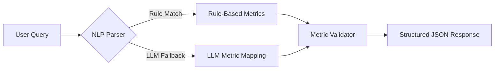

Great question! The system **can absolutely be an API**—it doesn’t need to be a conversational agent (like a chat interface) unless you want it to be. The key is designing the API to handle natural language input while maintaining stateless, deterministic behavior where possible. Here’s how to adapt the idea for a traditional API:

---

### **API-Centric Design (Non-Conversational)**

#### **1. Input/Output Structure**

**Request (POST `/recommend-metrics`)**:

```json
{
  "user_query": "I need metrics for a legal RAG system where factual accuracy is critical",
  "use_case": "legal_qa", // Optional: pre-defined use case tags
  "constraints": ["low-latency"] // Optional: explicit constraints
}
```

**Response**:

```json
{
  "recommended_metrics": ["faithfulness", "answer_correctness", "precision@5"],
  "reasoning": "Legal use cases prioritize factual accuracy, so 'faithfulness' and 'answer_correctness' are recommended. 'precision@5' ensures retrieval quality.",
  "fallback_metrics": ["answer_relevance", "retrieval_recall"], // Defaults if no clear signal
  "warnings": ["Avoid 'diversity@k' for strict fact-based tasks"]
}
```

#### **2. How It Works**

- **Natural Language Processing (NLP) Backend**:

  - Use a lightweight LLM (e.g., GPT-3.5, Mistral-7B) or a fine-tuned classifier to parse `user_query` and map it to metrics.
  - **No chat memory**: The API treats each request as independent (stateless).

- **Deterministic Overrides**:

  - Predefined rules (e.g., `use_case="legal_qa"` → always include `faithfulness`).
  - Keyword matching (e.g., "speed" → `latency@k`).

- **Explainability**:
  - Include `reasoning` in the response for transparency, but avoid back-and-forth dialogue.

#### **3. Advantages Over Conversational Agents**

- **Scalability**: Stateless APIs are easier to deploy and cache.
- **Integration**: Fits into existing workflows (e.g., called programmatically during eval setup).
- **Predictability**: No risk of unexpected chat behavior.

---

### **When to Use a Conversational Agent**

Only opt for a chat-like interface if:

1. Your users expect it (e.g., non-technical audiences).
2. The metric selection requires **multi-turn clarification** (e.g., _"Do you mean latency for retrieval or generation?"_).

---

### **Hybrid Approach: Best of Both Worlds**

For flexibility, offer **two modes**:

1. **API Mode**: Simple NLP → metric mapping (good for developers).
2. **Chat Mode**: Interactive clarification (good for exploratory use).

Example workflow:

```python
# Programmatic API call (no chat)
metrics = rag_api.recommend_metrics(
  query="Help me evaluate a healthcare chatbot's accuracy"
)

# Chat mode (if needed)
agent = rag_api.start_chat()
agent.send("I care about correctness and speed")
agent.send("Speed means fast retrieval, not generation")
metrics = agent.get_metrics()
```

---

### **Key Design Choices**

| **Design Aspect** | **API-Centric Approach**      | **Conversational Agent**     |
| ----------------- | ----------------------------- | ---------------------------- |
| **Statefulness**  | Stateless                     | Stateful (multi-turn)        |
| **Output**        | Structured JSON               | Free-form text + structured  |
| **Use Case**      | Automated pipelines           | Exploratory debugging        |
| **Complexity**    | Lower (no session management) | Higher (dialogue state, NLU) |

---

### **Implementation Tips**

1. **Start with the API**:

   - Use a lightweight LLM (e.g., `Mistral-7B`) for query understanding.
   - Cache common query → metric mappings to reduce LLM calls.

2. **Add Chat Later (If Needed)**:

   - Wrap the API in a stateful service (e.g., Slack/Discord bot, web UI).

3. **Document Tradeoffs**:
   - Clearly explain that the API is **single-turn** unless chat mode is enabled.

---

### **Example: Minimal API with FastAPI**

```python
from fastapi import FastAPI
from pydantic import BaseModel

app = FastAPI()

class MetricRequest(BaseModel):
    user_query: str
    use_case: str | None = None

@app.post("/recommend-metrics")
async def recommend_metrics(request: MetricRequest):
    # Call LLM or rule engine to map query to metrics
    metrics = parse_query(request.user_query, request.use_case)
    return {"metrics": metrics}

# Mock logic (replace with LLM/classifier)
def parse_query(query: str, use_case: str) -> list[str]:
    if "factual" in query or use_case == "legal_qa":
        return ["faithfulness", "answer_correctness"]
    return ["answer_relevance"]  # Default
```

---

### **Final Answer**

Your feature **can and should** be an API first. A conversational agent is optional and only worth adding if users demand interactivity. The API approach is:

- **Easier to implement** (no dialogue management).
- **More flexible** (works in CI/CD, notebooks, etc.).
- **Just as powerful** if you include clear reasoning in responses.

Would you like help designing the query-to-metric mapping logic? For example, we could explore fine-tuning a small model like `Mistral-7B` for this task.

---

## **Query to metric mapping**

Great! Here’s a **step-by-step blueprint** to implement your **metric recommendation API**, focusing on scalability, interpretability, and minimal LLM dependency. We’ll avoid conversational fluff and prioritize a clean, developer-friendly design.

---

### **1. Core Architecture**

#### **Inputs**

- Natural language query (e.g., `"I need metrics for a fact-checking RAG system"`).
- Optional structured hints (e.g., `domain="medical"`, `priority="accuracy"`).

#### **Outputs**

- Structured JSON with:
  - `recommended_metrics`: List of metric names (e.g., `["faithfulness", "answer_correctness"]`).
  - `reasoning`: Short justification (e.g., `"Fact-checking requires measuring hallucination risks"`).
  - `confidence_score`: 0-1 score for recommendation quality.
  - `fallback_metrics`: Defaults if confidence is low.

#### **Workflow**



---

### **2. Implementation Phases**

#### **Phase 1: Rule Engine (Fast, Deterministic)**

- **Keyword-to-Metric Lookup Table**:
  ```python
  RULES = {
      # Keywords → Metrics
      "factual": ["faithfulness", "answer_correctness"],
      "speed": ["latency@k", "tokens_per_second"],
      "diverse": ["diversity@k", "semantic_variety"],
      # Domains → Metrics
      "legal": ["faithfulness", "citation_precision"],
      "medical": ["answer_correctness", "comprehensiveness"]
  }
  ```
- **Matching Logic**:
  ```python
  def rule_based_match(query: str, domain: str = None) -> list[str]:
      metrics = []
      for keyword, keyword_metrics in RULES.items():
          if keyword in query.lower():
              metrics.extend(keyword_metrics)
      if domain and domain in RULES:
          metrics.extend(RULES[domain])
      return list(set(metrics))  # Deduplicate
  ```

#### **Phase 2: LLM Fallback (For Nuance)**

- **Lightweight LLM Call** (e.g., Mistral-7B-instruct):
  ```python
  def llm_metric_mapping(query: str) -> list[str]:
      prompt = f"""
      Recommend RAG evaluation metrics for this query. Return ONLY a JSON list:
      Query: "{query}"
      ["metric1", "metric2", ...]
      """
      response = call_llm(prompt)  # Your LLM client
      return json.loads(response)
  ```
- **Cache Responses**: Use Redis/Memcached to avoid redundant LLM calls for identical queries.

#### **Phase 3: Validation & Explainability**

- **Metric Validator**:
  - Reject invalid combinations (e.g., `diversity@k` for fact-checking).
  - Add warnings (e.g., `"latency@k may conflict with BERTScore"`).
- **Reasoning Generator**:
  ```python
  def generate_reasoning(query: str, metrics: list[str]) -> str:
      reasons = {
          "faithfulness": "Measures hallucination risks in generated answers",
          "diversity@k": "Ensures retrieved documents cover diverse perspectives"
      }
      return " ".join([reasons.get(m, "") for m in metrics])
  ```

---

### **3. Performance Optimization**

- **Precompute Common Queries**:
  - At startup, preload mappings for frequent queries (e.g., `"factual accuracy"`).
- **Hybrid Scoring**:
  ```python
  def recommend_metrics(query: str, domain: str = None) -> dict:
      # Rule-based first
      rule_metrics = rule_based_match(query, domain)
      confidence = min(1.0, len(rule_metrics) * 0.33)  # 0.33 per matched keyword

      # LLM fallback if low confidence
      if confidence < 0.7:
          llm_metrics = llm_metric_mapping(query)
          metrics = list(set(rule_metrics + llm_metrics))
          confidence = 0.8  # LLM boosts confidence

      return {
          "metrics": metrics,
          "confidence": confidence,
          "reasoning": generate_reasoning(query, metrics)
      }
  ```

---

### **4. API Endpoint (FastAPI Example)**

```python
from fastapi import FastAPI
from pydantic import BaseModel

app = FastAPI()

class MetricRequest(BaseModel):
    query: str
    domain: str | None = None

@app.post("/recommend-metrics")
async def recommend_metrics(request: MetricRequest):
    result = recommend_metrics(request.query, request.domain)
    return {
        "recommended_metrics": result["metrics"],
        "reasoning": result["reasoning"],
        "confidence": result["confidence"]
    }
```

---

### **5. Testing & Validation**

#### **Test Cases**

| **Query**                         | **Expected Metrics**                     | **Confidence** |
| --------------------------------- | ---------------------------------------- | -------------- |
| "Factual accuracy for legal docs" | `["faithfulness", "citation_precision"]` | 0.9            |
| "Speed and diversity"             | `["latency@k", "diversity@k"]`           | 0.8            |
| "Medical correctness"             | `["answer_correctness"]`                 | 1.0            |

#### **Evaluation Metrics for Your API**

- **Accuracy**: % of recommendations matching expert judgment.
- **Latency**: <500ms/request (cache critical for this).
- **User Overrides**: Track how often users ignore suggestions.

---

### **6. Deployment Options**

| **Approach**         | **Pros**              | **Cons**            |
| -------------------- | --------------------- | ------------------- |
| **Pure Rules**       | Fast, no LLM costs    | Limited flexibility |
| **Rules + LLM**      | Balances speed/nuance | LLM latency/costs   |
| **Fine-Tuned Model** | Highest accuracy      | Training overhead   |

**Recommendation**: Start with **Rules + LLM fallback**, then fine-tune a small model (e.g., `Mistral-7B`) if traffic justifies it.

---

### **7. Extensions (Future)**

- **Metric Cost Estimates**: Add `"evaluation_time_ms"` to responses.
- **User Feedback**: Log `👍/👎` to improve rules/LLM prompts.
- **Multi-Language Support**: Use multilingual LLMs (e.g., `NLLB`) for non-English queries.

---

### **Key Takeaways**

1. **Prioritize rules** for speed and determinism.
2. **Use LLMs sparingly**—only for ambiguous queries.
3. **Explain every recommendation** to build trust.
4. **Cache aggressively** to minimize latency/LLM costs.

Would you like a reference implementation (e.g., Colab notebook) for the hybrid rule+LLM approach?

---

## **Testing**

To **exhaustively test** the reliability, consistency, and reproducibility of your metric recommendation API, you’ll need a **multi-layered testing strategy** that covers both functional and non-functional requirements. Below is a systematic approach:

---

### **1. Functional Testing**

#### **A. Unit Testing (Rule-Based Logic)**

- **Goal**: Validate the deterministic keyword/domain → metric mappings.
- **Test Cases**:
  ```python
  def test_rule_based_match():
      # Keyword matching
      assert rule_based_match("factual accuracy") == ["faithfulness", "answer_correctness"]
      # Domain override
      assert rule_based_match("speed", domain="medical") == ["latency@k", "answer_correctness"]
      # Empty query
      assert rule_based_match("") == []
  ```
- **Edge Cases**:
  - Misspelled keywords (e.g., "factual acuracy" → fuzzy matching?).
  - Conflicting priorities (e.g., "speed and diversity" → both `latency@k` and `diversity@k`?).

#### **B. LLM Output Validation**

- **Goal**: Ensure the LLM returns parseable, relevant metrics.
- **Test Cases**:
  ```python
  def test_llm_fallback():
      # Test LLM response parsing
      assert llm_metric_mapping("factual accuracy") == ["faithfulness", "answer_correctness"]
      # Test invalid LLM output (e.g., "I don't know")
      assert llm_metric_mapping("gibberish") == []  # Fallback to defaults
  ```
- **Mock the LLM**:
  - Use a mock LLM client that returns predefined responses for reproducibility.

#### **C. Integration Testing (Full Pipeline)**

- **Goal**: Validate end-to-end behavior, including fallback logic.
- **Test Cases**:
  ```python
  def test_recommend_metrics():
      # Rule-based high confidence
      assert recommend_metrics("legal accuracy")["confidence"] >= 0.9
      # LLM fallback (low confidence)
      assert recommend_metrics("weird niche use case")["confidence"] < 0.7
  ```

---

### **2. Non-Functional Testing**

#### **A. Reliability (Failure Handling)**

- **Tests**:
  - **Malformed Inputs**: Send `None`, empty strings, or invalid JSON.
  - **LLM Unavailability**: Simulate LLM timeout/errors → verify fallback to rules.
  - **Metric Conflicts**: Test combinations like `["diversity@k", "faithfulness"]` → ensure validator rejects or warns.

#### **B. Consistency**

- **Goal**: Identical inputs → identical outputs, always.
- **Tests**:
  - Run the same query 100x and check for deterministic outputs.
  - Test across environments (local, staging, prod) with the same input.

#### **C. Reproducibility**

- **Goal**: Same results across time/versions.
- **Approach**:
  - **Versioned Test Data**: Save a corpus of 100+ diverse queries and expected outputs. Re-run periodically.
  - **LLM Seed Control**: If using probabilistic LLMs, fix the random seed during tests.

---

### **3. Statistical Testing**

#### **A. Metric Relevance Evaluation**

- **Goal**: Quantify how often recommendations match expert judgment.
- **Method**:
  1. Curate a **golden dataset** of 200+ queries with "correct" metrics (labeled by experts).
  2. Measure:
     - **Precision**: % of recommended metrics that are correct.
     - **Recall**: % of correct metrics that were recommended.
     - **F1 Score**: Balance of precision/recall.

#### **B. Confidence Score Calibration**

- **Goal**: Ensure `confidence=0.8` means 80% chance of being correct.
- **Method**:
  - Bin predictions by confidence score (0-0.1, 0.1-0.2, etc.).
  - Check if actual accuracy matches the confidence (e.g., 0.8 bin → 80% accurate).

---

### **4. Load & Latency Testing**

#### **A. Throughput**

- **Goal**: Handle expected traffic (e.g., 100 RPM).
- **Test**: Ramp up requests/sec until failure (use Locust/k6).
- **Acceptance Criteria**: <5% error rate at peak load.

#### **B. Latency**

- **Goal**: Meet SLA (e.g., p95 < 500ms).
- **Test**:
  - Measure latency for:
    - Rule-only queries (expected: <50ms).
    - LLM fallback queries (expected: <1s).
  - **Cache Impact**: Verify latency drops after caching.

---

### **5. A/B Testing (User-Facing)**

- **Goal**: Compare API recommendations against human/alternative systems.
- **Method**:
  - Deploy two versions:
    - **V1**: Your API.
    - **V2**: Rule-only baseline or human experts.
  - Measure:
    - **User Adoption**: % of users accepting recommendations.
    - **Downstream Impact**: Correlation between recommended metrics and eval quality.

---

### **6. Chaos Testing**

- **Goal**: Verify resilience to infrastructure failures.
- **Tests**:
  - Kill the LLM service mid-request → API should fall back to rules.
  - Throttle Redis cache → responses should degrade gracefully.

---

### **7. Regression Testing**

- **Automate**:
  - Run all tests on every commit (CI/CD pipeline).
  - Alert on performance/metric drift.

---

### **Test Environment Strategy**

| **Environment** | **Purpose**                     | **Tools**                    |
| --------------- | ------------------------------- | ---------------------------- |
| Local           | Unit/Integration tests          | Pytest, unittest             |
| Staging         | Load/chaos tests                | k6, Gremlin                  |
| Shadow Prod     | A/B test against real traffic   | Feature flags (LaunchDarkly) |
| Prod            | Canary deployments + monitoring | Prometheus, Datadog          |

---

### **Key Test Metrics to Monitor**

| **Metric**           | **Target** | **Tool**             |
| -------------------- | ---------- | -------------------- |
| Precision/Recall     | >90%       | Golden dataset       |
| p95 Latency          | <500ms     | Prometheus           |
| Cache Hit Rate       | >80%       | Redis metrics        |
| User Acceptance Rate | >70%       | Analytics (Mixpanel) |

---

### **Example Test Plan**

1. **Pre-Launch**:

   - Run unit + integration tests.
   - Validate against golden dataset (F1 > 0.9).
   - Load test to 2x expected traffic.

2. **Post-Launch**:

   - Monitor A/B test results for 1 week.
   - Track user overrides (if >30%, investigate).

3. **Ongoing**:
   - Weekly chaos tests.
   - Monthly golden dataset re-evaluation.

---

### **Tools to Use**

- **Testing**: Pytest, Locust, k6, Gremlin
- **Monitoring**: Prometheus, Datadog, ELK
- **A/B Testing**: LaunchDarkly, Optimizely
- **Golden Dataset**: Label Studio (for manual labeling)

By combining **automated tests**, **statistical validation**, and **real-world monitoring**, you’ll ensure the API behaves reliably under all conditions. Would you like a template for the golden dataset or load-testing script?

#deepseek
