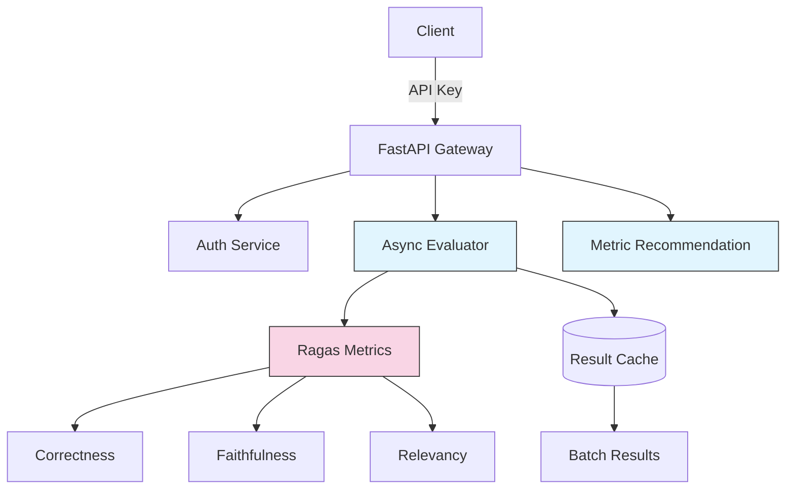
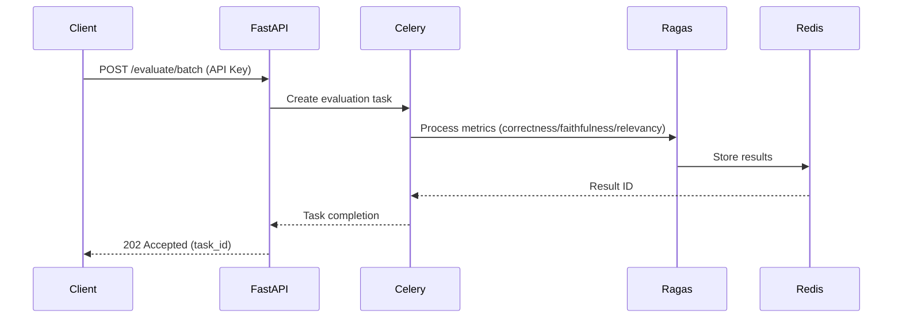

# System Patterns

This document describes the system architecture, key technical decisions, design patterns in use, component relationships, and critical implementation paths.

## System Architecture

The system follows a **microservice architecture** with the following components:

- **API Gateway (FastAPI)**: Handles incoming requests, authentication, and routing.
- **Evaluation Orchestrator**: Manages the execution of evaluation tasks.
- **Evaluators (Ragas Metrics)**: Individual services responsible for calculating specific evaluation metrics.
- **Result Cache (Redis)**: Stores evaluation results for quick retrieval.
- **Asynchronous Task Queue (Celery)**: Manages the asynchronous execution of evaluation tasks.

## Key Technical Decisions

- **FastAPI**: Chosen for its asynchronous capabilities, ease of use, and performance.
- **Ragas**: Selected as the primary library for RAG pipeline evaluation metrics.
- **Celery and Redis**: Used for asynchronous task processing to handle batch evaluations efficiently.
- **API Key Authentication**: Implemented for basic security.

## Design Patterns

- **Microservices**: The system is designed as a set of independent, loosely coupled services.
- **Asynchronous Processing**: Evaluation tasks are executed asynchronously to improve performance and scalability.

## Component Relationships

The API Gateway receives requests and authenticates them. It then routes the requests to the Evaluation Orchestrator, which creates tasks for the Evaluators and queues them using Celery. The Evaluators retrieve the tasks from the queue, perform the evaluation, and store the results in the Result Cache. The API Gateway can then retrieve the results from the cache and return them to the client.

### Workflow

## Deployment

- **cloud-first**
- **serverless**
