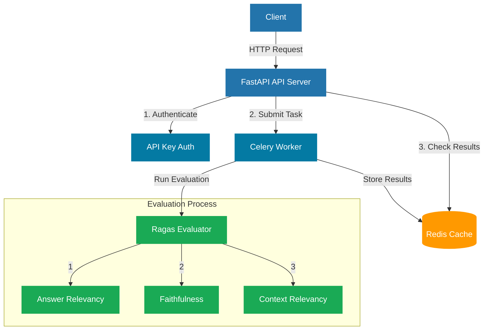

# RAG Evaluation API

A service for reference-free evaluation of Retrieval-Augmented Generation (RAG) pipeline outputs. This API enables automated assessment of RAG system responses without requiring ground truth or reference answers.

## Overview

This service provides automated evaluation of RAG pipeline outputs through reference-free assessment methods. Unlike traditional evaluation approaches that require human-annotated ground truth answers, this system analyzes the intrinsic quality of RAG outputs by examining:

- Answer relevancy to the original question
- Faithfulness to the provided context
- Context relevancy to the query

Reference-free evaluation is crucial for RAG systems because:

1. **Scalability**: Eliminates the need for expensive and time-consuming human annotations
2. **Real-world applicability**: Enables evaluation of responses to novel queries where no reference answers exist
3. **Continuous monitoring**: Allows automated quality assessment in production environments
4. **Bias reduction**: Removes human bias that may be present in reference-based evaluation methods
5. **Dynamic content handling**: Effectively evaluates responses for queries about frequently updated information

## Features

- Batch evaluation processing
- Asynchronous task handling
- Result caching
- Secure API access
- Comprehensive evaluation metrics:
  - Answer Relevancy: Measures how well the response addresses the query
  - Faithfulness: Assesses whether the response accurately represents the context
  - Context Relevancy: Evaluates if the retrieved context is appropriate for the query

## Requirements

- Python 3.12+
- Redis server
- Dependencies listed in pyproject.toml

## Installation

1. Clone the repository
2. Install dependencies:

```bash
uv venv
source .venv/bin/activate
uv pip install -e .
```

## Configuration

Configure the following settings in `app/config/settings.py`:

- `REDIS_URL`: Redis connection URL (default: "redis://localhost:6379")
- `RAGAS_THRESHOLD`: Evaluation threshold (default: 0.7)
- `API_KEY`: API authentication key

## Usage

1. Start the Redis server
2. Start the worker process:

```bash
celery -A app.celery worker --loglevel=info
```

3. Start the API server:

```bash
uvicorn app.main:app --reload
```

## API Endpoints

### POST /evaluate/batch

Submit content for evaluation:

```json
{
  "query": "What is the capital of France?",
  "context": "Paris is the capital of France.",
  "response": "The capital of France is Paris.",
  "metrics": ["answer_relevancy", "faithfulness", "context_relevancy"]
}
```

Returns a task ID for tracking the evaluation progress.

### GET /results/{task_id}

Retrieve evaluation results, including:

- Task ID
- Evaluation metric scores
- Creation timestamp
- Task status

## Authentication

Include your API key in requests:

```
X-API-Key: your_api_key_here
```

## System Architecture



The system consists of several key components:

1. **API Server**: Handles incoming HTTP requests, authentication, and task management
2. **Celery Worker**: Processes evaluation tasks asynchronously
3. **Redis Cache**: Stores task results and serves as message broker
4. **Ragas Evaluator**: Performs reference-free evaluation using three key metrics:
   - Answer Relevancy
   - Faithfulness
   - Context Relevancy

The workflow is as follows:
1. Client sends an evaluation request with query, context, and response
2. API server validates the API key and creates an asynchronous task
3. Celery worker processes the task using Ragas evaluator
4. Results are stored in Redis cache
5. Client can retrieve results using the task ID

## Development

Run tests:

```bash
pytest
```

## License

MIT License

## Author

Ayat Aboalnaga (ayat.aboalnaga@gmail.com)
